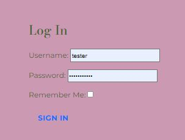

# Welcome to Berkshire Bookstore
Discover and share amazing books from around the world. The Berkshire Bookstore offers a vast collection of books across various genres, personalized recommendations, and user reviews, all with easy management features for users.


[View the live project here](https://berkshirebookstore-54bc6d6e349e.herokuapp.com/about/)


## Table of Contents
- [Welcome to Berkshire Bookstore](#welcome-to-berkshire-bookstore)
  - [Table of Contents](#table-of-contents)
  - [Introduction](#introduction)
  - [UX \& Wireframes](#ux--wireframes)
  - [Database Plan](#database-plan)
  - [Agile Development](#agile-development)
  - [Features](#features)
  - [Installation](#installation)
  - [Usage](#usage)
    - [Adding a Book](#adding-a-book)
    - [Writing a Review](#writing-a-review)
  - [Dependencies](#dependencies)
  - [Configuration](#configuration)
  - [Contributing](#contributing)
  - [License](#license)

## Introduction
Berkshire Bookstore is a platform designed for book enthusiasts who want to explore, discover, and share books. Whether you're into Fiction, Non-Fiction, Science Fiction, or Children's & Teenage books, this project aims to provide a seamless experience to its users by offering personalized recommendations, user reviews, and an easy-to-use book management system.

## UX & Wireframes
UK: The Berkshire Bookstore  Support All mobile,tablet and Website with a vast collection of books across various genres, personalized recommendations, and user reviews, all with easy management features for users.

Wireframes : The Berkshire BookStore website is designed with Bootstrap to allow for responsivness so can be easily used on mobile, tablet and desktop devices.


I used Balsamiq to create the wireframes. They were served as initial thnking and evolved during the build in line with Agile methodology.


## Database Plan

**Django AllAuth User Model:**

**Custom-made Book Model:**

|       Name       |         Type         |  Key  |
|------------------|----------------------|-------|
| `book_ID`        | CharField            |  PK     |
| `Category`       | CharField            |  FK   |
| `Creator`        | CharField            |       |
| `image`          | CloudnaryField       |       |
| `pages`          | TextField            |       |
| `description`    | TextField            |       |
| `approved`       | BooleanField      |       |
| `created_on`     | DateTimeField        |       |
| `updated_on`     | DateTimeField        |       |

**Custom-made Category Model:**

|       Name        |        Type         |  Key  |
|-------------------|---------------------|-------|
| `category_ID`     | CharField           |  PK   |
| `Book_ID`         | CharField           |  FK   |
| `Name`            | CharField           |       |

**Custom-made User Model:**

|       Name        |        Type         |  Key  |
|-------------------|---------------------|-------|
| `User_ID`     | CharField               |  PK   |
| `User_name`   | CharField               |       |

**Custom-made Review Model:**

|       Name        |        Type         |  Key  |
|-------------------|---------------------|-------|
| `Review_ID`       | CharField           |  PK   |
| `Book_ID`         | CharField           |  FK   |
| `User_id`         | CharField           |  FK   |
| `content`         | TextField           |       |
| `approved`        | BooleanField        |       |
| `created_on`      | DateTimeField       |       |
| `updated_on`      | DateTimeField       |       |

Relationship : Category -> (n) Book , user- > (n) Book  & Book-> (n) review


## Agile Development

The Agile Manifesto followed as per below:  A good user story should be:
“I” ndependent (of all others)
“N” egotiable (not a specific contract for features)
“V” aluable (or vertical)
“E” stimable (to a good approximation)
“S” mall (so as to fit within an iteration)
“T” estable (in principle, even if there isn’t a test for it yet)


## Features
- **Vast Collection**: Explore thousands of books across all genres, including Fiction, Non-Fiction, Science Fiction, and Children's & Teenage.
- **Personalized Recommendations**: Get book suggestions tailored to your reading preferences.
- **User Reviews**: Read reviews from other readers and share your thoughts on your favorite books.
- **Easy Management**: Add, edit, or delete books and reviews with ease by signing up or logging in. </br>

</br>
 
</br>
 


## Installation
1. Clone the repository:
    ```bash
    git clone https://github.com/rajends1/berkshirebookstore.git
    ```
2. Navigate to the project directory:
    ```bash
    cd berkshirebookstore
    ```
3. Install the required dependencies:
    ```bash
    pip install -r requirements.txt
    ```
4. Run the development server:
    ```bash
    python manage.py runserver
    ```

**Deployed to Heroku**
Connected Secret Keys to config vars
Connected Code Institute Sqlite Database

## Usage
Once the server is running, you can access the application in your web browser at `http://127.0.0.1:8000/`. Sign up or log in to start exploring books, receive personalized recommendations, and share your reviews.

### Adding a Book
- Go to the "Add Book" section after logging in.
- Fill in the book details and submit.

### Writing a Review
- Navigate to the book you want to review.
- Click on "Add Review" and submit your thoughts.

## Dependencies
- Python 3.x
- Django
- SQLite (for the database)
- Other dependencies listed in `requirements.txt`

## Configuration
You can modify the configuration settings in the `settings.py` file according to your environment, such as database settings, static files handling, and more.

## Contributing
Contributions are welcome! If you'd like to contribute, please fork the repository and create a pull request. You can also report issues or request features by opening an issue on GitHub.

## License
This project is licensed under the MIT License. See the [LICENSE](LICENSE) file for more details.
