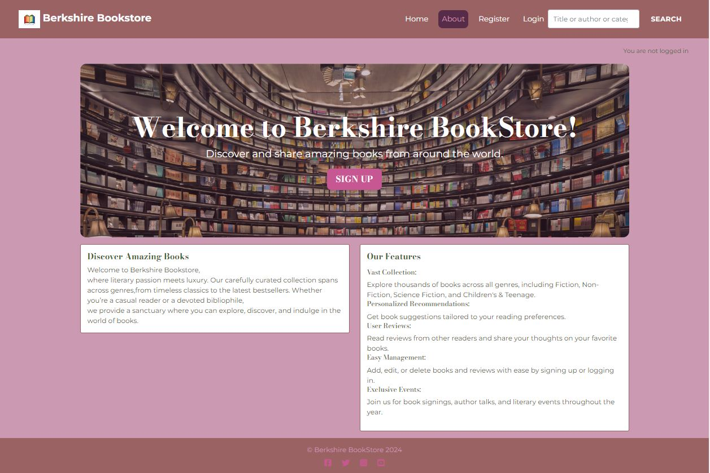

# Welcome to Berkshire Bookstore
Discover and share amazing books from around the world. The Berkshire Bookstore offers a vast collection of books across various genres, personalized recommendations, and user reviews, all with easy management features for users.


[View the live project here](https://berkshirebookstore-54bc6d6e349e.herokuapp.com/about/)


## Table of Contents
- [Welcome to Berkshire Bookstore](#welcome-to-berkshire-bookstore)
  - [Table of Contents](#table-of-contents)
  - [Introduction](#introduction)
  - [UX \& Wireframes](#ux--wireframes)
  - [Database Plan](#database-plan)
  - [Agile Development](#agile-development)
  - [Features](#features)
  - [QA](#qa)
  - [Installation](#installation)
  - [Usage](#usage)
    - [Adding a Book](#adding-a-book)
    - [Writing a Review](#writing-a-review)
  - [Dependencies](#dependencies)
  - [Configuration](#configuration)
  - [Contributing](#contributing)
  - [License](#license)

## Introduction
Berkshire Bookstore is a platform designed for book enthusiasts who want to explore, discover, and share books. Whether you're into Fiction, Non-Fiction, Science Fiction, or Children's & Teenage books, this project aims to provide a seamless experience to its users by offering personalized recommendations, user reviews, and an easy-to-use book management system.

## UX & Wireframes
UK: The Berkshire Bookstore  Support All mobile,tablet and Website with a vast collection of books across various genres, personalized recommendations, and user reviews, all with easy management features for users.

Wireframes : The Berkshire BookStore website is designed with Bootstrap to allow for responsivness so can be easily used on mobile, tablet and desktop devices.


I used Balsamiq to create the wireframes. They were served as initial thnking and evolved during the build in line with Agile methodology.


## Database Plan


**Django AllAuth User Model:**

**Custom-made Book Model:**

|       Name       |         Type         |  Key  |
|------------------|----------------------|-------|
| `book_ID`        | CharField            |  PK     |
| `Category`       | CharField            |  FK   |
| `Creator`        | CharField            |       |
| `image`          | CloudnaryField       |       |
| `pages`          | TextField            |       |
| `description`    | TextField            |       |
| `approved`       | BooleanField      |       |
| `created_on`     | DateTimeField        |       |
| `updated_on`     | DateTimeField        |       |

**Custom-made Category Model:**

|       Name        |        Type         |  Key  |
|-------------------|---------------------|-------|
| `category_ID`     | CharField           |  PK   |
| `Book_ID`         | CharField           |  FK   |
| `Name`            | CharField           |       |

**Custom-made User Model:**

|       Name        |        Type         |  Key  |
|-------------------|---------------------|-------|
| `User_ID`     | CharField               |  PK   |
| `User_name`   | CharField               |       |

**Custom-made Review Model:**

|       Name        |        Type         |  Key  |
|-------------------|---------------------|-------|
| `Review_ID`       | CharField           |  PK   |
| `Book_ID`         | CharField           |  FK   |
| `User_id`         | CharField           |  FK   |
| `content`         | TextField           |       |
| `approved`        | BooleanField        |       |
| `created_on`      | DateTimeField       |       |
| `updated_on`      | DateTimeField       |       |

Relationship : Category -> (n) Book , user- > (n) Book  & Book-> (n) review


## Agile Development

The Agile Manifesto followed as per below:  A good user story should be:
“I” ndependent (of all others)
“N” egotiable (not a specific contract for features)
“V” aluable (or vertical)
“E” stimable (to a good approximation)
“S” mall (so as to fit within an iteration)
“T” estable (in principle, even if there isn’t a test for it yet)
</br>
User Stories : </br>
**As a Site User**
#1 As a site user, I can register for new login and verify it so that I can access the platform.</br>
#2 As a site user, I can create, read, update, and delete my books to manage my books.</br>
#3 As a site user, I can like and comment on others' books  to engage with the books.</br>
#4 As a site user, I can search books  using a search bar to find relevant books easily.</br>
#5 As a site user, I can create, read, update, and delete my books to manage my books.</br></br>
**As a Site Admin**
#6 As a site user, I can create different category genre like thriller , adventure ..so on  to manage my books.</br>
#7 As a site admin, I can review and approve user-submitted books  so that I can approve or reject them based on books content.</br>
#8 As a site user, I can register for new login and verify it so that I can access the platform.</br>
#9 As a site user, I can create, read, update, and delete my books to manage my books.</br>
#10 As a site user, I can like and comment on others' books  to engage with the books.</br>
#11 As a site user, I can search books  using a search bar to find relevant books  easily.</br>


## Features
- **Vast Collection**: Explore thousands of books across all genres, including Fiction, Non-Fiction, Science Fiction, and Children's & Teenage.
- **Personalized Recommendations**: Get book suggestions tailored to your reading preferences.
- **User Reviews**: Read reviews from other readers and share your thoughts on your favorite books.
- **Easy Management**: Add, edit, or delete books and reviews with ease by signing up or logging in. </br>
</br>
</br>

 
</br>
 


## QA
 I will outline recommendations for HTML, CSS, JavaScript, and Python validation, as well as tools for Continuous Integration (CI), automated testing, manual testing, and bug tracking.
1. **HTML Validation**
•	Tool: W3C Markup Validation Service
o	Achievement: Ensure that all HTML pages on the project are compliant with W3C standards. This can prevent rendering issues across different browsers.
o	Action: Ran my HTML files through the W3C Validator and fix any validation errors.
2.** CSS Validation**
•	Tool: W3C CSS Validation Service
o	Achievement: Validate the CSS to ensure styling works consistently across different browsers and platforms.
o	Action: Use the W3C CSS Validator to check my CSS files for errors and warnings, and correct them as necessary.
3. **JavaScript Validation**
•	Tool: ESLint or JSHint
o	Achievement: Improve the quality and consistency of my JavaScript code by adhering to defined coding standards.
o	Action: Integrate ESLint or JSHint into my project to identify potential issues in my JavaScript code. Configure the linter with a ruleset that matches my project's coding standards.
4. **Python Validation**
•	Tool: Pylint, Flake8, or Black
o	Achievement: Ensure that Python code is clean, consistent, and follows PEP 8 standards.
o	Action: Add Pylint or Flake8 to my CI pipeline to automatically check Python code quality. Use Black for consistent formatting.
5. **CI Python Linter Integratio**n
•	Tool: GitHub Actions, Travis CI, or CircleCI
o	**Achievement**: Automate the validation of code on every commit and pull request.
o	**Action**: Set up a CI pipeline with GitHub Actions that runs linters (e.g., ESLint for JS, Flake8 for Python) and tests on every push to the repository. This ensures continuous feedback on code quality.
6. **Automated Testing**
•	Tool: Pytest for Python, Jest for JavaScript, Selenium for end-to-end testing
o	**Achievement**: Increase confidence in code changes by automating tests for both back-end and front-end.
o	**Action**: Write unit tests for Python with Pytest, JavaScript unit tests with Jest, and end-to-end tests using Selenium. Integrate these tests into my CI pipeline to run automatically.
7. **Manual Testing**
•	**Tool**: a well-organized GitHub Project board
o	**Achievement**: Systematically document and execute test cases manually, covering edge cases that automated tests might miss.
o	**Action**: Create detailed test cases and scenarios in a tool like on GitHub Projects. Regularly perform exploratory testing to identify potential issues not covered by automated tests.
8. **Bug Tracking**
•	I will outline recommendations for HTML, CSS, JavaScript, and Python validation, as well as tools for Continuous Integration (CI), automated testing, manual testing, and bug tracking.
1. **HTML Validation**
•	**Tool**: W3C Markup Validation Service
o	**Achievement**: Ensure that all HTML pages on the project are compliant with W3C standards. This can prevent rendering issues across different browsers.
o	**Action**: Ran my HTML files through the W3C Validator and fix any validation errors.
2. **CSS Validation**
•	**Tool**: W3C CSS Validation Service
o	**Achievement**: Validate the CSS to ensure styling works consistently across different browsers and platforms.
o	**Action**: Use the W3C CSS Validator to check my CSS files for errors and warnings, and correct them as necessary.
3. **JavaScript Validation**
•	**Tool**: ESLint or JSHint
o	**Achievement**: Improve the quality and consistency of my JavaScript code by adhering to defined coding standards.
o	**Action**: Integrate ESLint or JSHint into my project to identify potential issues in my JavaScript code. Configure the linter with a ruleset that matches my project's coding standards.
4.** Python Validation**
•	**Tool**: Pylint, Flake8, or Black
o	**Achievement**: Ensure that Python code is clean, consistent, and follows PEP 8 standards.
o	**Action**: Add Pylint or Flake8 to my CI pipeline to automatically check Python code quality. Use Black for consistent formatting.
5. CI Python Linter Integration
•	**Tool**: GitHub Actions, Travis CI, or CircleCI
o	**Achievement**: Automate the validation of code on every commit and pull request.
o	**Action**: Set up a CI pipeline with GitHub Actions that runs linters (e.g., ESLint for JS, Flake8 for Python) and tests on every push to the repository. This ensures continuous feedback on code quality.
6. **Automated Testing**
•	**Tool**: Pytest for Python, Jest for JavaScript, Selenium for end-to-end testing
o	**Achievement**: Increase confidence in code changes by automating tests for both back-end and front-end.
o	**Action**: Write unit tests for Python with Pytest, JavaScript unit tests with Jest, and end-to-end tests using Selenium. Integrate these tests into my CI pipeline to run automatically.
7.** Manual Testing**
•	**Tool**: TestRail or a well-organized GitHub Project board
o	**Achievement**: Systematically document and execute test cases manually, covering edge cases that automated tests might miss.
o	**Action**: Create detailed test cases and scenarios in a tool like TestRail or on GitHub Projects. Regularly perform exploratory testing to identify potential issues not covered by automated tests.
8. **Bug Tracking**
•	**Tool**: GitHub Issues
o	**Achievement**: Efficiently track, prioritize, and manage bugs within the project.
o	**Action**: Use GitHub Issues to document bugs. Label and categorize them based on severity, feature, and status. Ensure that bugs are linked to specific commits or pull requests to trace their resolution.
**Implementation on GitHub Repository** </br></br>
•	**Action Steps:** </br>
1.	•	Set up GitHub Actions for CI/CD, integrating automated linters and test runners for each language used in the project.
•	Regularly run W3C Validators for HTML and CSS, and integrate JavaScript and Python linters as part of the CI pipeline.
•	Writetten unit tests and expand coverage gradually, aiming for comprehensive test suites.
•	Use GitHub Issues to manage manual testing, bug tracking, and release management effectively.
•	Consider writing documentation that includes best practices for each area (HTML/CSS/JS/Python) and instructions for contributors on maintaining code quality.

</br>
| **User Story ID** | **User Story Description**                       | **Test Condition**                                            | **Expected Result**                                          | **Actual Result**                                           | **Status** | **Comments**                   |
|-------------------|--------------------------------------------------|---------------------------------------------------------------|--------------------------------------------------------------|-------------------------------------------------------------|------------|--------------------------------|
| US001             | User can view the homepage                       | Access homepage                                               | Homepage loads successfully with correct content             | Homepage loaded successfully with all content displayed     | Pass       | None                           |
| US002             | User can search for books                        | Search for a book using the search bar                        | Search results display books that match the search term      | Search results displayed accurately                         | Pass       | None                           |
| US003             | User can view book details                       | Click on a book from the search results                       | Detailed page of the selected book loads with accurate info  | Book details page loaded with correct information           | Pass       | None                           |
| US005             | User can view the list                           | Access the list from the top menu                             | List  page loads with correct items                           | list page displayed the correct items                      | Pass       | None                           |
| US006             | User can proceed to checkout                     | Click 'Checkout' button in the list                           | User is redirected to checkout page                          | Checkout page loaded successfully                           | Pass       | None                           |
| US007             | User can remove books from the list              | Click 'Remove' button next to a book in the list              | Book is removed from the list, list updates                  | Book was removed from the list, list updated accordingly    | Pass       | None                           |
| US008             | User can complete a purchase                     | Fill out payment information and confirm purchase             | Order is placed successfully and confirmation message shown  | Purchase completed successfully with confirmation message   | Pass       | None                           |
| US009             | User receives a confirmation email after purchase| Complete a purchase                                           | User receives a confirmation email with order details        | Confirmation email received with correct details            | Pass       | None                           |
| US010             | User can view order history                      | Access 'Order History' from the user account menu             | User's past orders are displayed                             | Order history page displayed all previous orders            | Pass       | None                           |
| US011             | User can log in and log out                      | Use the login and logout functionality                        | User is able to log in and log out successfully              | Login and logout worked as expected                         | Pass       | None                           |
| US012             | User can update account information              | Edit account details in the user account section              | Account information is updated and saved successfully        | Account information updated and saved without errors        | Pass       | None                           |
| US013             | Admin can add new books                          | Admin accesses book management section and adds a new book    | New book appears in the catalog after adding                 | New book was added successfully and appeared in catalog     | Pass       | None                           |
| US014             | Admin can update book information                | Admin edits details of an existing book in the catalog        | Updated book information is saved and displayed correctly    | Book information updated and displayed correctly            | Pass       | None                           |
| US015             | Admin can delete a book from the catalog         | Admin deletes a book from the catalog                         | Book is removed from the catalog                             | Book was successfully removed from the catalog              | Pass       | None                           |

</br>
By following these best practices and using the recommended tools, I have improved the quality, maintainability, and reliability of my  berkshirebookstore project on GitHub.

: GitHub Issues
o	Achievement: Efficiently track, prioritize, and manage bugs within the project.
o	Action: Use GitHub Issues to document bugs. Label and categorize them based on severity, feature, and status. Ensure that bugs are linked to specific commits or pull requests to trace their resolution.
Implementation on GitHub Repository
•	Action Steps:
1.	Set up GitHub Actions for CI/CD, integrating automated linters and test runners for each language used in the project.
2.	Regularly run W3C Validators for HTML and CSS, and integrate JavaScript and Python linters as part of the CI pipeline.
3.	Writetten unit tests and expand coverage gradually, aiming for comprehensive test suites.
4.	Use GitHub Issues to manage manual testing, bug tracking, and release management effectively.
5.	Consider writing documentation that includes best practices for each area (HTML/CSS/JS/Python) and instructions for contributors on maintaining code quality.
By following these best practices and using the recommended tools, I have improved the quality, maintainability, and reliability of my  berkshirebookstore project on GitHub.


## Installation
1. Clone the repository:
    ```bash
    git clone https://github.com/rajends1/berkshirebookstore.git
    ```
2. Navigate to the project directory:
    ```bash
    cd berkshirebookstore
    ```
3. Install the required dependencies:
    ```bash
    pip install -r requirements.txt
    ```
4. Run the development server:
    ```bash
    python manage.py runserver
    ```

**Deployed to Heroku**
Connected Secret Keys to config vars
Connected Code Institute Sqlite Database
Steps :
1.	Install the Heroku CLI
2.	Download and install the Heroku CLI.

3.	If you haven't already, log in to your Heroku account and follow the prompts to create a new SSH public key.

4.	$ heroku login
5.	Clone the repository
6.	Use Git to clone berkshirebookstore's source code to your local machine.

7.	$ heroku git:clone -a berkshirebookstore$ cd berkshirebookstore
8.	Deploy your changes
9.	Make some changes to the code you just cloned and deploy them to Heroku using Git.

10.	$ git add .
11.	$ git commit -am "make it better"
12.	$ git push heroku master
13.	$ heroku logs -t


## Usage
Once the server is running, you can access the application in your web browser at `http://127.0.0.1:8000/`. Sign up or log in to start exploring books, receive personalized recommendations, and share your reviews.

### Adding a Book
- Go to the "Add Book" section after logging in.
- Fill in the book details and submit.

### Writing a Review
- Navigate to the book you want to review.
- Click on "Add Review" and submit your thoughts.

## Dependencies
- Python 3.x
- Django
- SQLite (for the database)
- Other dependencies listed in `requirements.txt`

## Configuration
You can modify the configuration settings in the `settings.py` file according to your environment, such as database settings, static files handling, and more.

## Contributing
Contributions are welcome! If you'd like to contribute, please fork the repository and create a pull request. You can also report issues or request features by opening an issue on GitHub.

## License
This project is licensed under the MIT License. See the [LICENSE](LICENSE) file for more details.
